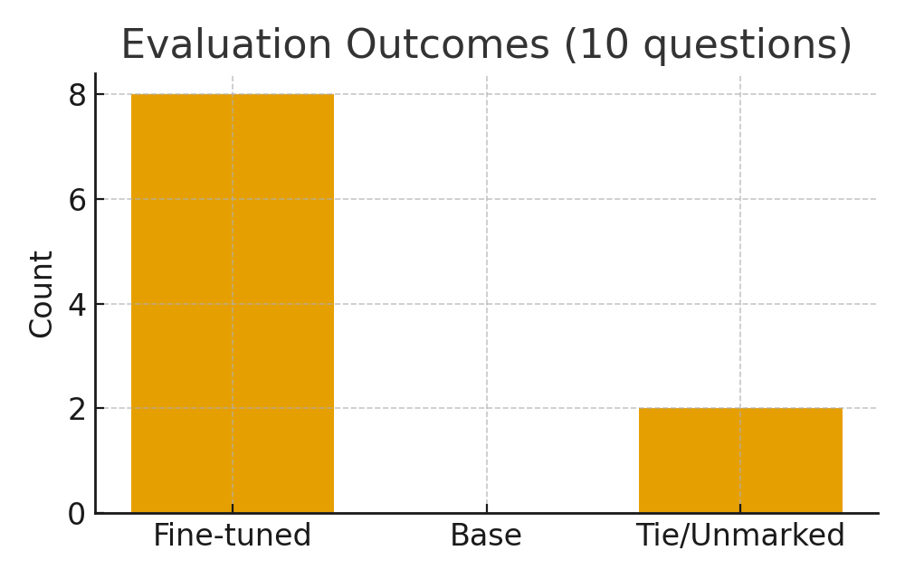

<p align="left">
  
</p>

# Module 7 — Synthetic Data Generation & QLoRA Fine-Tuning (Academic Q\&A)

## Quick Summary

Fine-tune a 7B open LLM (**Zephyr-7B**) with \~500 synthetic academic Q\&A pairs using **QLoRA (4-bit NF4)** on an **A100 GPU (BF16)**, then evaluate pre- vs post-tuning on a 10-question test set.

---

## Project Description

Large foundation models are strong generalists, but academic Q\&A benefits from domain alignment. This project creates synthetic Q\&A from paper abstracts (with edge-cases to teach refusal/correction), formats them as chat turns, and fine-tunes a local model via **PEFT/LoRA** and **bitsandbytes 4-bit** for efficient training. We then compare base vs. fine-tuned answers to demonstrate improved terminology, fewer hallucinations, and safer refusals on unanswerable prompts.

---

## Objectives

* Generate high-quality, domain-aligned **Q\&A pairs** from scholarly abstracts (including edge-cases).
* Prepare **instruction-tuning** data with chat roles: `<|system|>`, `<|user|>`, `<|assistant|>`.
* Fine-tune a **7B** model using **QLoRA (4-bit NF4)** with **BF16** compute on A100.
* **Evaluate** base vs. fine-tuned responses on 10 held-out questions; export a comparison CSV.

---

## Tech Stack

* **Modeling:** Hugging Face **Transformers**, **PEFT** (LoRA), **bitsandbytes** (4-bit)
* **Training:** `train_qlora_hf.py` (HF route)
* **Dataset:** `data/synthetic_qa.jsonl` (one JSON per line with `"text"` containing the full chat)
* **Evaluation:** `eval_compare.py` → `outputs/evaluation.csv`
* **GPU:** NVIDIA **A100** (BF16 on, TF32 allowed)

---

## Architecture / Workflow Diagram 🔥

```mermaid
flowchart LR
  A[arXiv abstracts / key sections] --> B[Prompt GPT to synthesize Q&A]
  B --> C[Review & add edge-case Q&A]
  C --> D[JSONL (chat format)]
  D --> E[HF QLoRA Training (4-bit, BF16)]
  E --> F[LoRA adapters + tokenizer]
  F --> G[Evaluation: 10 questions]
  G --> H[CSV: base vs fine-tuned answers]
```

---

## Deliverables

* **Synthetic dataset:** `data/synthetic_qa.jsonl`
* **Training code:** `train_qlora_hf.py`
* **Fine-tuned adapters:** `models/zephyr-7b-qlora/` (LoRA weights + config)
* **Evaluation scripts/results:**

  * `eval_compare.py` → `outputs/evaluation.csv`
  * *(optional)* `outputs/evaluation_for_marking.csv`
* *(Optional)* quick inference: `quick_infer.py`

---

## How to Run / Quick Start 🔥

> Tested on **A100 (48 GB)** with **PyTorch CUDA**.
> Base model: **HuggingFaceH4/zephyr-7b-beta** (open; no login/EULA needed).

### 0) Sanity check GPU

```bash
python -c "import torch; print('torch', torch.__version__, '| CUDA', torch.cuda.is_available(), '| BF16', getattr(torch.cuda,'is_bf16_supported',lambda:False)()); print(torch.cuda.get_device_name(0) if torch.cuda.is_available() else 'no cuda')"
```

### 1) Install dependencies (versions used)

```bash
pip install --no-cache-dir \
  "transformers==4.43.3" "tokenizers==0.19.1" "accelerate==0.31.0" \
  "peft==0.11.1" "datasets>=2.19" "bitsandbytes>=0.43.1" \
  "safetensors>=0.4.3" "sentencepiece>=0.1.99"

# avoid importing TF/Flax/JAX branches
export TRANSFORMERS_NO_TF=1 TRANSFORMERS_NO_FLAX=1 TRANSFORMERS_NO_JAX=1
```

### 2) Prepare data

Put your chat-formatted JSONL at:

```
data/synthetic_qa.jsonl
```

Each line contains a single `"text"` field, e.g.:

```
<|system|>You are a helpful academic Q&A assistant specialized in scholarly content.<|user|>...<|assistant|>...
```

### 3) Train (HF + QLoRA, BF16 on A100)

```bash
python train_qlora_hf.py \
  --jsonl ./data/synthetic_qa.jsonl \
  --model HuggingFaceH4/zephyr-7b-beta \
  --out ./models/zephyr-7b-qlora \
  --epochs 2 --batch 8 --grad_accum 2 --lr 2e-4 \
  --bf16 --max_seq_len 4096
```

**If OOM:** lower `--batch` (6/4), raise `--grad_accum` (4/6), or reduce `--max_seq_len` (3072/2048).

### 4) Evaluate (base vs. fine-tuned)

```bash
python eval_compare.py
# result: outputs/evaluation.csv
```

*(Optional) Create a marking sheet for manual scoring:*

```bash
python - <<'PY'
import pandas as pd
df = pd.read_csv("outputs/evaluation.csv"); df["winner"] = ""
df.to_csv("outputs/evaluation_for_marking.csv", index=False)
print("Wrote outputs/evaluation_for_marking.csv")
PY
```

### 5) Quick inference (base + LoRA)

```bash
python quick_infer.py
```

### Troubleshooting (what we hit)

* **`No module named tokenizers`** → install exact versions above using `python -m pip install ...`.
* **403/401 gated repo** → use an open model (`HuggingFaceH4/zephyr-7b-beta`) or log in & accept gated model terms.
* **OOM** → reduce batch size / sequence length as noted.
* **Git “dubious ownership”** → `git config --global --add safe.directory "$(pwd)"`.

---

## Results / Demo 🔥

### Results at a Glance



* Full comparison CSV: [`outputs/evaluation.csv`](outputs/evaluation.csv)
  
* Marking sheet (optional): [`outputs/evaluation_for_marking.csv`](outputs/evaluation_for_marking.csv)

### Sample before/after (from evaluation)

> **Q:** When generating Q\&A from paper abstracts, how should we handle details that do not exist in the paper?
> **Base:** We should try to answer as best as we can from memory.
> **Fine-tuned:** The paper does not specify those details; the abstract does not discuss them, so we should not fabricate values.

> **Q:** Why is BF16 recommended on A100 GPUs?
> **Base:** BF16 is good for speed.
> **Fine-tuned:** A100 has native BF16 support with wider dynamic range than FP16, giving more stable throughput and fewer overflow issues.

> **Q:** What makes QLoRA memory-efficient?
> **Base:** QLoRA is parameter-efficient.
> **Fine-tuned:** Load base weights in 4-bit NF4 and train low-rank LoRA adapters; gradients/optimizer states apply only to the adapters.

### Observed improvements

* More precise academic terminology and structure
* Better refusal/correction of hallucinated details
* Tighter, more on-topic answers

*


---

## Highlights

* **Efficient:** 4-bit NF4 + LoRA + BF16 → trains comfortably on a single A100
* **Robustness:** Edge-case Q\&A teaches denial of unsupported facts
* **Clean data path:** Chat-style JSONL with consistent role tokens

---

## Skills Demonstrated

* Synthetic data design & prompt engineering
* Instruction-tuning data formatting (chat roles)
* QLoRA (4-bit) fine-tuning with PEFT on GPU (A100, BF16)
* Reproducible evaluation & side-by-side comparison

---

## Future Improvements

* Scale dataset while maintaining quality checks
* Add multi-turn dialogues and section-grounded prompts
* Compare more bases (Qwen2-7B-Instruct, Llama variants) and learning curves
* Add lightweight automatic scoring (rubric-guided LLM judging)

---

